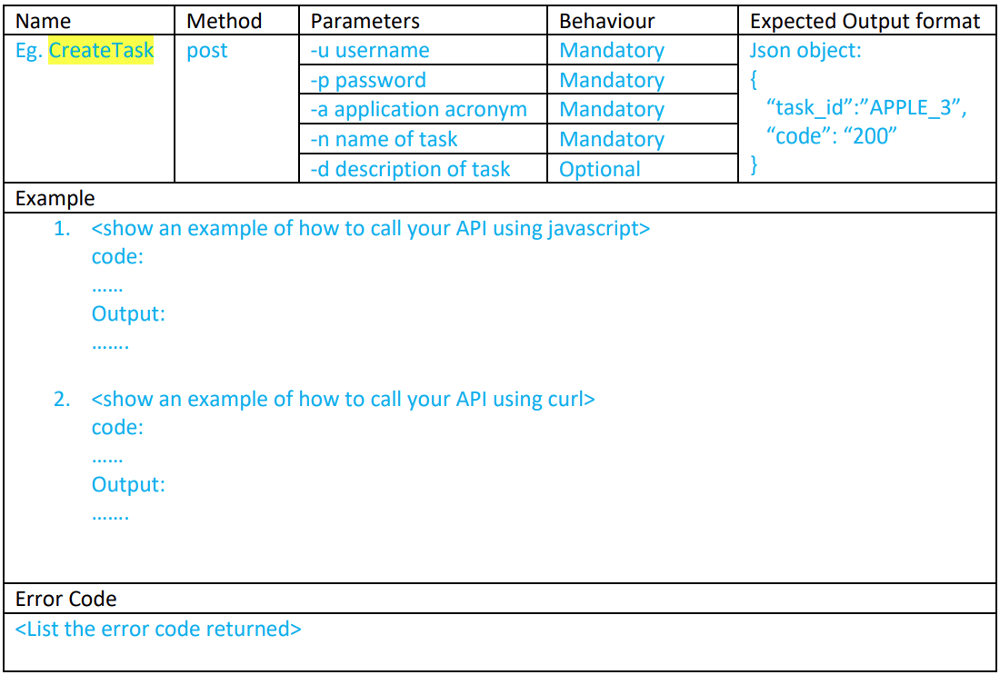

  
Table of Contents

  <ul>
    <li><a href="#assignment-1---to-implement-the-user-management-features">Assignment 1 - To implement the user management features</a>
      <ul>
        <li><a href="#basic-user-management">Basic User Management</a></li>
        <li><a href="#privilege-user-management--security">Privilege User Management & Security</a></li>
      </ul>
    </li>
    <li><a href="#assignment-2---to-implement-the-task-management-features">Assignment 2 - To implement the Task Management features</a>
      <ul>
        <li><a href="#defining-the-workflow">Defining the Workflow</a></li>
        <li><a href="#defining-the-data-model-and-custom-fields">Defining the Data Model and Custom Fields</a></li>
        <li><a href="#defining-the-screen">Defining the Screen</a></li>
      </ul>
    </li>
    <li><a href="#assignment-3---to-implement-2-rest-api-for-tms">Assignment 3 - To implement 2 REST API for TMS</a>
      <ul>
        <li><a href="#crud-transactions">CRUD Transactions</a></li>
        <li><a href="#test-data">Test Data</a></li>
      </ul>
    </li>
    <li><a href="#assignment-4---to-containerize-the-apis-in-assignment-3">Assignment 4 - To containerize the APIs in assignment 3</a>
      <ul>
        <li><a href="#set-up-docker">Set up Docker</a></li>
      </ul>
    </li>
    <li><a href="#assignment-5-optional---performance-and-security">Assignment 5 (Optional) - Performance and Security</a>
      <ul>
        <li><a href="#database-connection-performance">Database Connection (Performance)</a></li>
        <li><a href="#application-access-control-security">Application Access Control (Security)</a></li>
      </ul>
    </li>
  </ul>

&nbsp;

## About the Project

- In this assignment we shall build a <b>Task Management System (TMS) that emulate the Kanban approach that support the Planning, Tracking, and Approving for the task activities related to a specific project.</b>.

&nbsp;

---

&nbsp;

## Assignment 1

### Objectives

1. Identity and access control of an application
2. State transition with pre & post actions to be triggered for a workflow which is usually implemented in projects. Eg Case management, eSOP, etc. The pre & post actions contain the process/business rules, constraints for the respective business workflows
3. REST API for system integration purposes
4. Containerize the Nodejs application and API

&nbsp;

### Basic User Management

- Create the login screen
- Create a main menu screen with the “User Management” Option
- Create the following functions under the User Management
  - Create new User
  - Change password for current login user
  - Update email information
- Repeat step 1 to show the email is updated.
- You would need to create a function that returns a value to indicate if a user is in a group. Eg. Checkgroup(userid, groupname)

&nbsp;

### Privilege User Management & Security

- Create <b>admin privilege account(s)</b> to allow:
  - <b>Create user</b>
  - <b>Disable user</b>
    - Note: you would need to create a field in the database to indicate the user account is <b>disabled or active. Deletion of user account is not allowed</b> as this information could be used in the Task Management activities and audit trail is needed even if the user is no longer allowed to access the application.
  - <b>Reset</b> other user account password and related information.
    - <b>Note: </b>you cannot allow user id to be changed as per para (1.b.i)
  - <b>Note: </b>You can design an <b>“admin” account</b> which we assume is part of the Task Management application set up by default. You would need to
- Ensure the <b>password is not stored in clear text</b> in the database which is a violation to security requirement. You can explore the use of password hashing approach which is a single direction which does not support the recreation of the password. IE, you will compare the hashed password for authentication. You can consider the use of the bcrypt or argon2 module.
- Ensure the <b>password</b> comprises of the following characteristics
  - Minimum 8 characters and maximum 10 characters
  - Comprise of alphabets , numbers, and special character

&nbsp;

---

&nbsp;

## Assignment 2 - To implement the Task Management features

### Objectives

1. Understand the workflow needed to implement the lifecycle of a “task” which is akin to any case management related system.
2. Understand the custom fields need to be captured as data to support the “task”.
3. Understand the “screen” which the custom fields shall be associated to as the interface to the system.
4. Understand how to implement the Task Management features related to specific state of the workflow in terms of access management, pre-validation, and post-action needed for the state transition to occur. (across multiple SQL tables for CRUD transactions)

&nbsp;

### Defining the Workflow

- To define the workflow of TMS, we shall <b>identify the persona</b> involved in the <b>user stories</b>. The user stories
  includes the following:
  - As a project lead, I would need to <b>define and store my applications information</b> for my project to be used to trace to all the Plans and Tasks to work on.
  - As a project manager, I would need to plan all the scheduled MVP(s) with the <b>start and end date</b> as per my project plan/schedule.
  - As a project lead, I would need to <b>define all the tasks that is required in X sprints</b> needed to deliver the MVP.
  - As a team member, I would need to work on the tasks and <b>seek approval to close the task from the team lead</b> when done.
- You are required to implement the workflow for the “Task” only. State indicated as the box and arrow is the action taken (bold & underlined text) to trigger a state transition.

- Implement which user-group can perform the state transition as per workflow (pre-validation). The user-group shall be configurable for each “Application” team within the project. (see the Application Table below. Eg. User-group permitted to create the task is defined in App_permit_create)
- Implement an <b>email notification</b> to the lead when the team member has promoted the task to “Done” state (post-action)
- Implement a <b>task-id using the format of [application_acronym]\_[running number]</b>. The task-id is assigned whenever a task is created (open state). IE. The task-id shall be system generated and always in <b>read-only mode</b>.
- Implement an <b>audit trail (read-only) of the notes</b> provided throughout the life-cycle of the task. The notes shall be stamped with
  - logon userid
  - current state
  - date & timestamp.

&nbsp;

### Defining the Data Model and Custom Fields

- The TMS data model shall be represented in your MySQL as follows:
- <b>Note: </b>The colour code in the field represents the relationship. <b>App_Acronym, Plan_MVP_name, and Task_name shall only be provided during its creation and shall remain as read-only</b> thereafter since this would be the table key.

&nbsp;

### Defining the Screen

- In this assignment, you are given the autonomy to decide how you would design the UI of TMS. However, do keep in mind the <b>UX aspect to ensure the ease of use and efficiency factor</b>.

&nbsp;

---

&nbsp;

## Assignment 3 - To implement 2 REST API for TMS

### Objectives

1. Understand how REST API operates from the security and assessment aspect
2. Understand how REST API can be designed to be scalable

&nbsp;

### CRUD Transactions

- In this assignment you would have to create the following API on the nodejs platform.
  - Create a new task (method name = <b>CreateTask</b>)
  - Retrieve tasks in a particular state (method name = <b>GetTaskbyState</b>)
  - Approve a task from “Doing to Done” state (method name = <b>PromoteTask2Done</b>)
- As you design and build these API, you would need to consider the scope of what each API does so as to extend these implementations to Microservices design if possible. Since the tenet of microservices focus on scalability with a limited scope of work. However, do make sure that you do not fall into the pitfall of creating a mini-service as a result of using the “common code / shared services” approach which result in wastage of processing and memory requirements when deploying these “services” in the Kubernetes pod.

&nbsp;

### Test Data

- Before performing a test, you need to decide what data you are going to include in your test case.
  It is not normally possible to perform tests with every single possible piece of data. So, instead
  the developers will choose from a limited range of data such as:
  - <b>valid data: </b>sensible, possible data that the program should accept and be able to process
  - <b>extreme data: </b>valid data that falls at the boundary of any possible ranges
  - <b>invalid (erroneous) data: </b>data that the program cannot process and should not accept
- Tests should find that the program works as expected. Obvious input data should confirm that the software works as expected. Extreme test data will be chosen to test what breaks the system.

&nbsp;

---

&nbsp;

## Assignment 4 - To containerize the APIs in assignment 3

### Objectives

1. Understand how containerize the API using dockerfile and relevant considerations
2. Understand how to reduce the size of your container image using a streamlined OS without effecting the function of the API to be delivered.

&nbsp;

### Set up Docker

- [Install Docker (engine)](https://docs.docker.com/desktop/windows/install/)
- [containerize your API on node.js](https://nodejs.org/en/docs/guides/nodejs-docker-webapp/)
  - Create a dockerfile
  - Identify the builder image from docker hub to use
  - Build your image
  - Import your image into Docker Desktop
  - Define your Container/App in Docker Desktop
  - Execute the Container to start the APIs
  - You are required to build your application container image in less than 200Mb in size.
- <b>Note: </b>Consider the size of the application container image and how you will transport this image to another environment (air-gap) with different database connection information. You would also to ensure you are not using the root account when running your application container image for security purpose.

&nbsp;

---

&nbsp;

## Assignment 5 (Optional) - Performance and Security

### Database Connection (Performance)

- As a developer, you may not have spent a lot of time thinking about database connections. A single database connection is not expensive, but as things scale up, problems can emerge.
- [Pooling Connections in Node.js & MySQL](https://medium.com/dscjssstu/pooling-connections-in-node-js-mysql-9685d5c03c30)
- [Node.js and MySQL Connection Pool Example](https://codeforgeek.com/node-mysql-connection-pool-example/)

&nbsp;

### Application Access Control (Security)

- As part of some sensitive application implementation, you would most likely encounter the following requirements:
  - Ensure there is a user <b>timeout</b> capability (fixed or customizable)
  - Ensure the application does not allow a user to have more than <b>1 concurrent login</b>
  - Ensure there is a user <b>login/logout audit trail</b>

&nbsp;

---

&nbsp;
