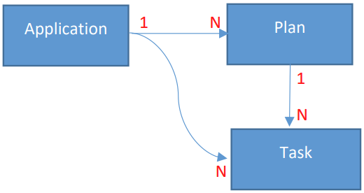
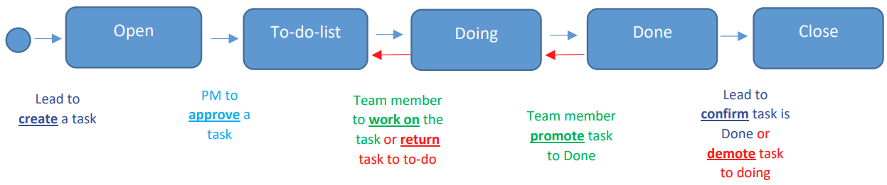
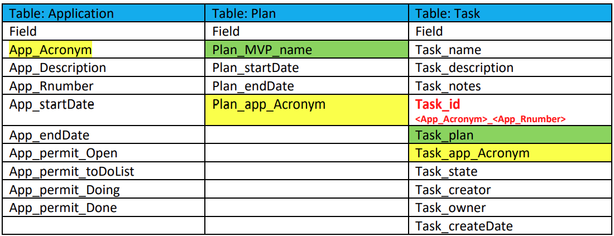

## About the Project

- <b>Task Management System (TMS)</b> that emulate the Kanban approach that support the Planning, Tracking, and Approving for the task activities related to a specific project.
  - <b>Tech Stack: </b>MySQL, Express, ReactJS & NodeJS <b>(MERN)</b>
  - <b>Phase 1: </b>Basic user and user group management setup
  - <b>Phase 2: </b>Kanban with access management, pre-validation, and post-action during the lifecycle of a task.

&nbsp;

---

&nbsp;

## Current Features

### To implement the user management features

- [Authentication with refresh token](https://stackoverflow.com/a/69631076)
- Default application setup with 1 Admin account
- <b>User management interface (Admin only):</b>
  - Create new user
  - Change user's username or email
  - Change user's password
  - Assign/remove user to/from usergroup(s)
  - Disable user's account
    - Cannot disable Admin account
  - Check if given username is in user group
    - <b>Backend only: </b>use to check access rights in phase 2 (Task management) of the project
- <b>Update profile interface (User or Admin):</b>
  - Change email
  - Change password
- <b>Password Requirements:</b>
  - Minimum 8 characters and maximum 10 characters
  - Comprise of alphabets, numbers, and special character

&nbsp;

---

&nbsp;

### To implement the Task Management features

- <b>Applications interface</b>
  - Project Lead to create/update application and set the usergroup access rights
- <b>Kanban interface</b>
  - Create/update plan and task
  - Tag the same color to plan and task(s)
  - Promote, demote and close task base on usergroup access rights
  - Email will be sent to all Project Leads once the task has been promoted to "Done" state by respective usergroup
  - Read-only audit trail (Task_notes) to track the lifecycle of the task
  - Add notes to task

- App_Acronym, Plan_MVP_name, and Task_name are the table keys

&nbsp;

---

&nbsp;

### To implement 2 REST API for TMS

- <b>a3Routes</b>: GetTaskbyState, CreateTask & PromoteTask2Done

| Error Code |      Status      |                                                                          Description                                                                          |
| :--------: | :--------------: | :-----------------------------------------------------------------------------------------------------------------------------------------------------------: |
|    4001    |   Unauthorized   |                                                      Indicates that the user is unauthenticated (login)                                                       |
|    4002    |    Forbidden     | The client does not have access rights to the content. In other words, the client is unauthorized so the server is refusing to render the requested resource. |
|    4003    |    Duplicated    |                                         The data already exists in the database. User has to enter a brand new entry.                                         |
|    4004    |    Not Found     |                                                                 The requested URL is invalid.                                                                 |
|    4005    |  Invalid Field   |                            Incorrect, erroneous or unacceptable data was being sent back to the database. The request was invalid.                            |
|    4006    |   Empty Field    |                                                           Mandatory field but input field is empty.                                                           |
|    4008    | Invalid JSON Key |                                                               JSON key is invalid or misspelt.                                                                |

&nbsp;

---

&nbsp;
