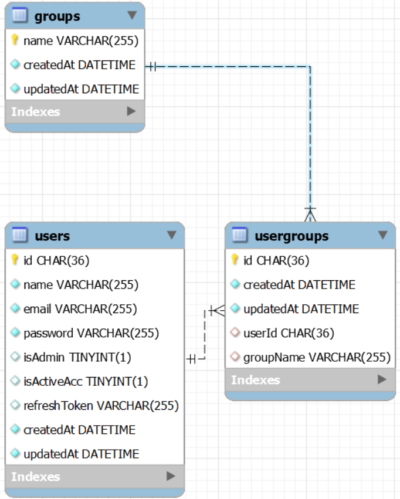

## About the Project

- <b>Task Management System (TMS)</b> that emulate the Kanban approach that support the Planning, Tracking, and Approving for the task activities related to a specific project.
  - <b>Tech Stack: </b>MySQL, Express, ReactJS & NodeJS <b>(MERN)</b>
  - <b>Phase 1: </b>Basic user and user group management setup

&nbsp;

---

&nbsp;

## Current Features

- [Authentication with refresh token](https://stackoverflow.com/a/69631076)
- Default application setup with 1 Admin account
- <b>User management interface (Admin only):</b>
  - Create new user
  - Change user's username or email
  - Change user's password
  - Assign/remove user to/from usergroup(s)
  - Disable user's account
    - Cannot disable Admin account
  - Check if given username is in user group
    - <b>Backend only: </b>use to check access rights in phase 2 (Task management) of the project
- <b>Update profile interface (User or Admin):</b>
  - Change email
  - Change password
- <b>Password Requirements:</b>
  - Minimum 8 characters and maximum 10 characters
  - Comprise of alphabets, numbers, and special character

&nbsp;

---

&nbsp;
