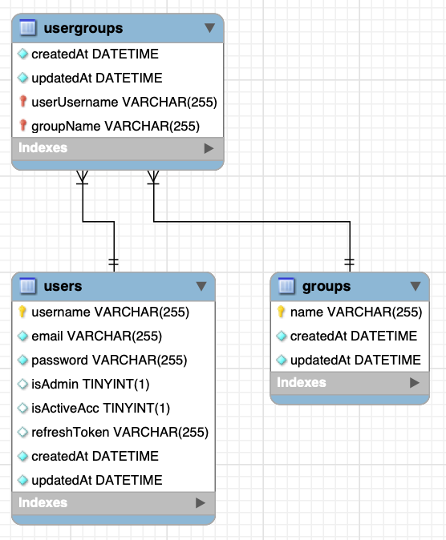

## About the Project

- <b>Task Management System (TMS)</b> that emulate the Kanban approach that support the Planning, Tracking, and Approving for the task activities related to a specific project.
  - <b>Tech Stack: </b>MySQL, Express, ReactJS & NodeJS <b>(MERN)</b>
  - <b>Phase 1: </b>Basic user and user group management setup
  - <b>Phase 2: </b>Kanban with access management, pre-validation, and post-action during the lifecycle of a task
  - <b>Phase 3: </b>Documentation for API endpoints, test cases and Postman
  - <b>Phase 4: </b>Containerization with Docker

&nbsp;

---

&nbsp;

## Features

### To implement the user management features

- [Authentication with refresh token](https://stackoverflow.com/a/69631076)
- Default application setup with 1 Admin account
- <b>User management interface (Admin only):</b>
  - Create new user
  - Change user's username or email
  - Change user's password
  - Assign/remove user to/from usergroup(s)
  - Disable user's account
    - Cannot disable Admin account
  - Check if given username is in user group
    - <b>Backend only: </b>use to check access rights in phase 2 (Task management) of the project
- <b>Update profile interface (User or Admin):</b>
  - Change email
  - Change password
- <b>Password Requirements:</b>
  - Minimum 8 characters and maximum 10 characters
  - Comprise of alphabets, numbers, and special character

&nbsp;

---

&nbsp;

### To implement the Task Management features

- <b>Applications interface</b>
  - Project Lead to create/update application and set the usergroup access rights
- <b>Kanban interface</b>
  - Create/update plan and task
  - Tag the same color to plan and task(s)
  - Promote, demote and close task base on usergroup access rights
  - Email will be sent to all Project Leads once the task has been promoted to "Done" state by respective usergroup
  - Read-only audit trail (Task_notes) to track the lifecycle of the task
  - Add notes to task

- App_Acronym, Plan_MVP_name, and Task_name are the table keys

&nbsp;

---

&nbsp;

### To implement 2 REST API for TMS

- <b>a3Routes</b>: GetTaskbyState, CreateTask & PromoteTask2Done

| Error Code |        Status        |                                                                                     Description                                                                                     |
| :--------: | :------------------: | :---------------------------------------------------------------------------------------------------------------------------------------------------------------------------------: |
|    4001    |     Unauthorized     |                                                                 Indicates that the user is unauthenticated (login)                                                                  |
|    4002    |      Forbidden       |            The client does not have access rights to the content. In other words, the client is unauthorized so the server is refusing to render the requested resource.            |
|    4003    |      Duplicated      |                                                    The data already exists in the database. User has to enter a brand new entry.                                                    |
|    4004    |      Not Found       |                                                                            The requested URL is invalid.                                                                            |
|    4005    |    Invalid Field     |                                       Incorrect, erroneous or unacceptable data was being sent back to the database. The request was invalid.                                       |
|    4006    |     Empty Field      |                                                                      Mandatory field but input field is empty.                                                                      |
|    4007    | Incorrect Transition | The task exists but the task state must be prior to “Done”, i.e., “Doing”. However, if user entered “Close”, it is a valid task state but not in the correct transition task state. |
|    4008    |   Invalid JSON Key   |                                                                          JSON key is invalid or misspelt.                                                                           |

&nbsp;

---

&nbsp;

### To containerize the APIs

- Docker application backend container image size of less than 200mb
  - User will need to have mySQL installed on the host machine
- Transporting the image to another environment (air-gap) with different database connection information
- Ensure that the root account is not used when running the image for security purpose.
- cURL on Windows Powershell:
  - May need to use `Remove-Item alias:curl` to run cURL commands that send JSON object.

&nbsp;

---

&nbsp;
